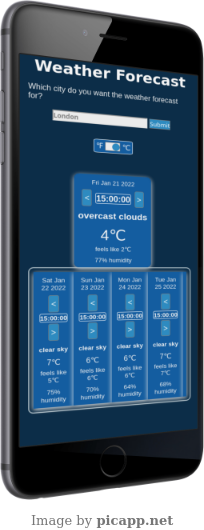

# Weather Forecasting App

## Description

This app provides a 5-day weather forecast, with a 3-hour timestep corresponding to the city you ask for.

It starts off by providing the data for the 5 days to the nearest 3 hours from when it is fetched.

The default temperature metric is in degrees Fahrenheit but you can toggle this to Celsius. 

## Remarks 

I made this app primarily to test my understanding of asynchronous Javascript by fetching data from [Open Weather](https//openweathermap.org) through their API.
This was a relatively simple implementation, but it did help crystallise the intuition behind the difference between asynchronous calls and synchronous calls. 

The core part of the learning experience occurred when I was implementing some basic error-handling. The context underlying this is that error notifications pop up if the user attempts to toggle to a timestep that lies beyond the date on the card they are toggling on (so attempting to fetch data after 21:00 or before 00:00). This also applies when you attempt to fetch data before the present three-hour period of the same day. 

The error notifications are generated through a class when the user clicks the button to toggle the time in the fashion described above. At the closing stages of the routine, an event handler is attached to the document's body: this is a click event that closes the error notification.

The problem with this implementation is that the click event has yet to bubble upward when the handler has been registered, once that happens the notification is removed. In effect: it never appears.

Of course, this is is easily addressed by preventing the bubbling from occurring through `event.stopPropagation()`, but this begs the question: 
### What does all this have to do with asynchronous behaviour?

Well, I applied the same error notification class to a catch statement in the Javascript Promise which is initialised when you click the button that makes the API call, and I let the event bubble up even after attaching the handler to the document's body. 

In spite of this, the notification shows up and the bubbling has *no effect*.

My hypothesis was that the event's bubbling is part of the synchronous workflow, so the function is only called after the event has finished propagating.
But I was not satisifed so I tested it with some code similar to the following blurb: 

          .catch(function(){
                            if(document.querySelector('.dummy')){

                            let error = new errorCard('This is a test');
                            error.makeErrorCard();
                            return

                            }
                        })

                        const dummyFunction = function(){
                            const dummy = document.createElement('div');
                            dummy.classList.add('dummy')
                            document.body.appendChild(dummy)
                        }
                        document.body.addEventListener('click', dummyFunction)

#### Note: this branches off from when the catch clause begins. 

We can observe that dummyFunction is added synchronously because it is declared outside the catch clause. **If the entire code was synchronous** then one would expect the call stack to execute the functions in the order prescribed by the code flow, and if that was the case:

1. When the user presses the button, `document.querySelector('.dummy')` would return `null`, so 
2. The condition remains unfulfilled and the `errorCard` is never initialised, then
3. The "dummy" function is declared, and the event handler is attached to the body, then
4. The event bubbles up, the handler attached to the body is called and an empty 'dummy' div is attached to the body, ***but there is
no error notification because the condition in the first steps was not fulfilled.***  

But because the function in the catch clause is asynchronous, `dummyFunction` and `document.body.addEventListener('click',dummyFunction)` *have to be executed* before the callback from the catch clause can be retrieved from the callback queue. This means that in the asynchronous case:

1. The button fetching the data is pressed, then
2. The "dummy" function is declared, and the event handler is attached to the body, then
3. The click event bubbles upward and the "dummy" div is initialised and is appended to the body, and *only then*
4. The call stack is empty, and the catch clause is executed, it checks that the dummy div exists and produces the error notification.

### Some other takeaways I took from making this: 

- Applied some cross-browser testing for the first time, and through it I realised belatedly that my CSS reset was not being effected.
- Learned a little bit more about design and animations when I made the toggle button and the loading spinner in particular. 
- Used sessionStorage for the first time to be able to manipulate state. 

## Limitations to keep in mind:

Going into this, I felt that this would be a small project, with really no backend so I eschewed the following which would be included in most apps I would make at this moment in time:
- Webpack;
- Linter & Prettify;
- Modules;

Also, I retrieve all the data at once and let the user choose which parts to render depending on the timestep they want. This is less than ideal, and is not a pattern
I would implement at all in an app I would expect actual traffic from. 

Cross-browser testing was limited since I was relying on freeware so that is another limitation that can be mitigated to make the app a lot more responsive.

If I were to spend more time on this, I would prioritise user experience more when toggling between times in the sense that if the user wants to go beyond the 24-hour period then either the card associated with the next/previous day's data is emphasised or the clock simply restarts the cycle, instead of having error notifications pop up each time.

Finally, and this is an important point: 
> **I would take measures not to expose an API key to the client** 
##### (but this one is free and therefore dispensable)

